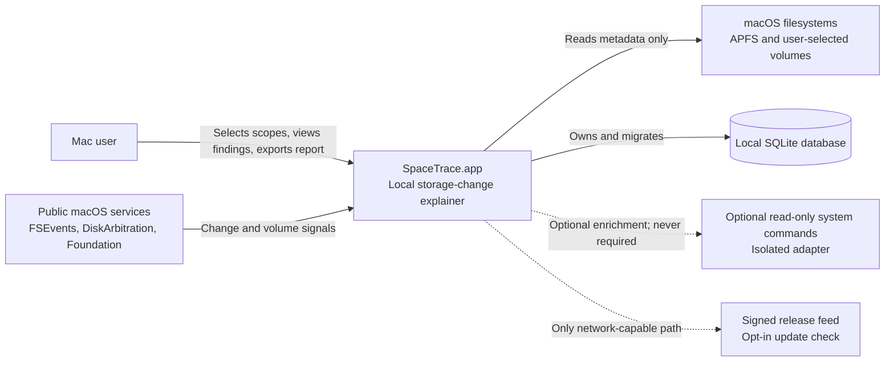
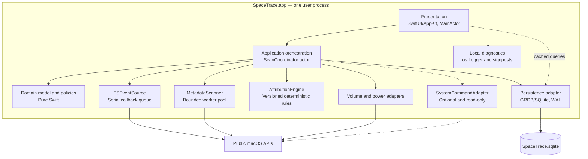
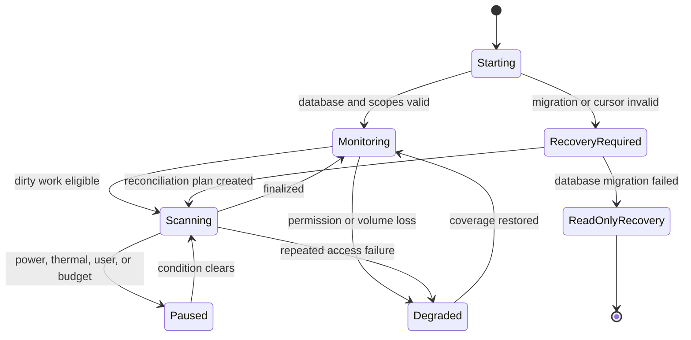
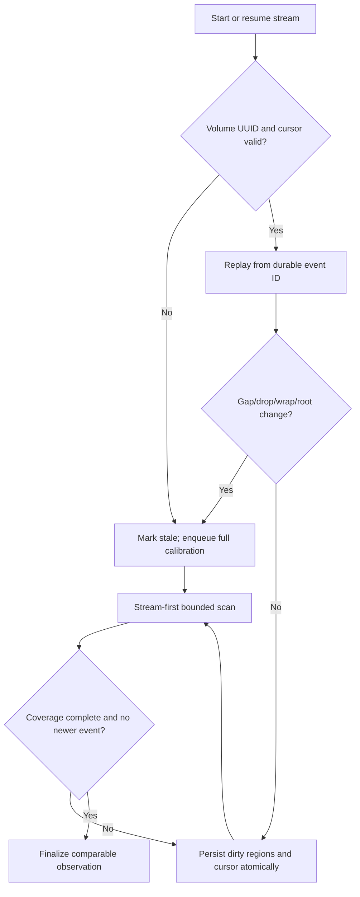

# SpaceTrace Technical Architecture

| Field | Value |
| --- | --- |
| Status | Proposed for MVP design review |
| Document version | 0.1 |
| Last updated | 2026-07-18 |
| Current project target | macOS 15.6, Swift version setting 5.0 |
| Accepted product baseline | macOS 15.6+, Apple Silicon first; Intel deferred |
| Architecture owner | SpaceTrace maintainers |
| Related decisions | [ADR-001](decisions/ADR-001-native-macos-platform.md), [ADR-002](decisions/ADR-002-read-only-optional-full-disk-access.md), [ADR-003](decisions/ADR-003-fsevents-and-calibration-scans.md), [ADR-004](decisions/ADR-004-sqlite-persistence-and-retention.md), [ADR-005](decisions/ADR-005-system-command-adapter.md) |

## 1. Executive summary

SpaceTrace is a local-first macOS application that answers a deliberately narrow question:

> What observable data caused this Mac's storage usage to grow over time?

The proposed MVP is a native, single-process, modular monolith built with Swift and SwiftUI/AppKit. It watches user-approved scopes with FSEvents, treats those events only as invalidation hints, and produces facts through bounded metadata scans. Current directory aggregates, time-bucketed observations, scan coverage, event checkpoints, and explainable findings are persisted in a local SQLite database.

The design makes four promises and refuses a fifth:

1. It records changes locally and does not require an account or cloud service.
2. It is read-only with respect to user files; it never deletes, modifies, hydrates, or kills anything.
3. It distinguishes measured values from inferred classifications and reports incomplete coverage.
4. It remains useful without Full Disk Access (FDA), while explaining what an optional FDA grant would reveal.
5. It does **not** promise to reproduce Apple's “System Data” number, determine which process wrote a file, or calculate uniquely reclaimable APFS bytes.

No private API, privileged helper, kernel extension, system extension, or destructive system command is part of the MVP core. Direct distribution with Developer ID signing, Hardened Runtime, and notarization is the architecture recommendation because broad read-only filesystem observation is incompatible with an App Sandbox-only product experience; signing/notarization and update ownership remain release-preparation decisions until separately approved.

## 2. Context, goals, and constraints

### 2.1 Product context

Existing storage visualizers answer “what is large now.” SpaceTrace is differentiated by preserving comparable observations so it can answer “what grew, when, by how much, and what evidence supports the explanation.” The market research and evidence boundary are documented in [macos-opportunity-research-2026.md](../research/macos-opportunity-research-2026.md).

### 2.2 Architecture goals

- Show cached storage state quickly while background work remains bounded and cancellable.
- Survive app termination, OS restart, volume remount, event loss, permission changes, and partial scans without silently inventing zero-byte values.
- Make every finding traceable to observations, coverage, a deterministic classification rule, and a confidence level.
- Keep the UI, domain rules, platform APIs, persistence, and optional command execution independently testable.
- Permit future support for external volumes and additional classifiers without changing the core truth model.
- Keep operational ownership appropriate for a small open-source team: one application, one local database, no backend.

### 2.3 Non-goals for MVP

- Cleaning, deleting, compressing, moving, or deduplicating user data.
- Exact process-level writer attribution. FSEvents does not provide process identity.
- A byte-for-byte clone of macOS Storage Settings or its “System Data” taxonomy.
- Exact reclaimable-space accounting for APFS clones, snapshots, purgeable content, or cloud placeholders.
- Continuous real-time accounting while the app is not running.
- Network-attached filesystem monitoring, remote administration, team dashboards, or cross-device sync.
- Root privileges, a daemon, Endpoint Security, privileged helpers, kernel extensions, or private frameworks.

### 2.4 Current project facts and accepted baseline

The repository currently contains an initial Xcode project with these settings:

- `MACOSX_DEPLOYMENT_TARGET = 15.6` for Project, App, Unit Tests, and UI Tests;
- bundle identifier `com.TREAFREE.SpaceTrace`;
- Swift language version setting `5.0`;
- automatic signing enabled.

ADR-001 accepts macOS 15.6 and Apple Silicon as the initial support baseline. The project owner has aligned every build configuration to that floor. This establishes the deployment contract but does not prove runtime qualification: before Public Beta, every P0 adapter and user journey must pass on a physical or virtual macOS 15.6 environment. The team must also review bundle-identifier ownership and release signing rather than treating the initial automatic-signing configuration as production-ready.

Accepted platform constraints:

- Deployment target: macOS 15.6 or later.
- Primary release/test architecture: arm64. Intel is unsupported until separately accepted.
- Default behavior works with ordinary user permissions; FDA is an optional enhancement.
- The application never follows symbolic links and never crosses a volume boundary unless that volume is an explicit watch scope.
- All durable state is local to the user's Application Support directory and excluded from SpaceTrace's own scans.
- No telemetry. Diagnostic export is explicit, local, and redacted by default.
- Path-level history defaults to 30 days and is user-visible and clearable. No longer default is permitted without a PRD/RFC change.

## 3. Truth contract and terminology

The architecture uses precise terms so the UI cannot accidentally overstate what macOS exposes.

| Term | Meaning | Must not be presented as |
| --- | --- | --- |
| Volume available bytes | A point-in-time value returned by public volume resource APIs | Bytes that one particular directory can reclaim |
| Logical bytes | Sum of logical file lengths observed during a scan | Physical disk consumption |
| Observed allocated bytes | Sum of allocated block values observable per file | Unique APFS extents or guaranteed reclaimable bytes |
| Directory aggregate | Sum produced from entries successfully observed beneath a directory | Complete when coverage is partial |
| Storage change | Difference between comparable observations using the same metric and scope | Process attribution |
| Classification | Deterministic mapping from path/context evidence to a human-readable category | Proof of ownership or causality |
| Unattributed volume change | Volume-level change not explained by comparable scanned paths | Automatically “System Data” |
| Coverage | What was visited, skipped, inaccessible, raced, or unknown during a scan | A permission grant status |

Core invariant: **unknown is not zero**. An inaccessible, unmounted, evicted, or raced path never overwrites the last complete measurement with zero and is never reported as deletion without complete parent coverage.

## 4. Quality attributes and priorities

Priority order for MVP decisions:

1. **Correctness and epistemic honesty** — incomplete evidence stays incomplete.
2. **Privacy and safety** — local-only, read-only, least privilege, no filename logging.
3. **Recoverability** — durable event cursors and dirty work; interrupted scans resume or restart safely.
4. **Resource restraint** — scanning yields to foreground work, battery, low-power, and thermal pressure.
5. **Maintainability** — explicit ports and module boundaries in a modular monolith.
6. **Freshness** — useful near-real-time updates, but never at the expense of the first five priorities.

## 5. System context and component boundaries

### 5.1 C4 level 1: system context



SpaceTrace has no application backend. The optional release feed is not part of analysis and cannot receive scan data.

### 5.2 C4 level 2/3: runtime components



### 5.3 Dependency rule

Dependencies point inward:

```text
SpaceTraceApp / SpaceTraceUI
              ↓
SpaceTraceApplication (use cases and orchestration)
              ↓
SpaceTraceDomain (entities, policies, ports)
              ↑
SpaceTraceFileSystem / SpaceTracePersistence / SpaceTracePlatform
```

`SpaceTraceDomain` imports Foundation only where value types require it and never imports SwiftUI, AppKit, CoreServices, DiskArbitration, GRDB, or process APIs. Infrastructure modules implement protocols owned by the domain/application boundary. CI enforces forbidden imports and rejects cycles.

## 6. Module and repository layout

Evolve the existing Xcode application project toward one local Swift package with multiple targets. This is a proposed layout, not an assertion that the initial scaffold already has these modules. Multiple packages or services would add release and dependency complexity without independent deployment needs.

```text
SpaceTrace/
├── App/
│   ├── SpaceTraceApp/                  # executable, lifecycle, entitlements
│   └── SpaceTraceUITests/
├── Packages/
│   └── SpaceTraceKit/
│       ├── Package.swift
│       ├── Sources/
│       │   ├── SpaceTraceDomain/
│       │   ├── SpaceTraceApplication/
│       │   ├── SpaceTraceFileSystem/
│       │   ├── SpaceTracePersistence/
│       │   ├── SpaceTraceAttribution/
│       │   ├── SpaceTracePlatform/
│       │   ├── SpaceTraceMonitoring/
│       │   └── SpaceTraceUI/
│       └── Tests/
│           ├── SpaceTraceDomainTests/
│           ├── SpaceTraceIntegrationTests/
│           ├── SpaceTraceMigrationTests/
│           └── SpaceTracePerformanceTests/
├── Resources/
│   ├── ClassificationRules/
│   └── Privacy/
└── docs/
```

| Module | Responsibility | Explicit exclusions |
| --- | --- | --- |
| `SpaceTraceDomain` | Value types, invariants, confidence, coverage, retention policy, scan-plan policy | Platform calls and persistence details |
| `SpaceTraceApplication` | Use cases, lifecycle state machine, scheduling, backpressure, recovery | UI rendering and direct syscalls |
| `SpaceTraceFileSystem` | FSEvents, metadata enumeration, file identity, size observation | Classification and user messaging |
| `SpaceTracePersistence` | Schema, migrations, repositories, staging/finalization, retention | Product policy beyond data integrity |
| `SpaceTraceAttribution` | Versioned path classifiers and evidence generation | Running shell commands or guessing processes |
| `SpaceTracePlatform` | Volume, mount, power, thermal, launch-at-login, optional commands | Domain decisions |
| `SpaceTraceMonitoring` | Non-UI native composition and owned lifecycle tasks | UI state and user-visible policy |
| `SpaceTraceUI` | Menu bar, timeline, findings, health, permission education | Filesystem scanning |
| `SpaceTraceApp` | Composition root, signing settings, app lifecycle | Business logic |

## 7. Runtime, process, and concurrency model

### 7.1 Process model

MVP uses one menu-bar-capable application process. Closing the main window does not stop monitoring; quitting the app does. Optional launch at login uses the public Service Management API and is user-controlled. There is no LaunchDaemon, XPC helper, login-item helper executable, or root process.

This choice keeps FDA scope, code signing, crash recovery, and updates understandable. A helper may only be reconsidered if measured app-lifecycle constraints prevent the agreed freshness SLO.

### 7.2 Concurrency ownership

| Owner | Mechanism | Responsibilities |
| --- | --- | --- |
| UI state | `@MainActor` | Render cached state, send intents, consume progress snapshots |
| `ScanCoordinator` | Swift actor | State machine, queues, leases, policy, cancellation, backpressure |
| FSEvents callback | Dedicated serial `DispatchQueue` | Copy callback data into owned values and enqueue it; never scan or query UI |
| Database | `DatabaseActor` wrapping GRDB `DatabasePool` | One logical writer, migrations, durable work, consistent reads |
| File metadata | Dedicated utility QoS worker pool | Blocking enumeration/stat calls with at most two workers |
| Classification | Pure tasks, bounded | Transform completed observations into evidence; no I/O |

Blocking filesystem calls must not run on `MainActor` or monopolize Swift's cooperative executor. The scanner exposes an `AsyncThrowingStream<ScanBatch>` backed by dedicated queues. Each batch contains at most 500 aggregate mutations or 2 MiB of encoded data, whichever comes first.

Cancellation is cooperative at directory and batch boundaries. Cancelling a scan does not finalize staged data. A later run either resumes from a durable checkpoint where safe or discards only that incomplete stage and starts a new scan.

### 7.3 Lifecycle states



## 8. Key data flows

### 8.1 First-run baseline

1. User accepts the truth contract and chooses a recommended scope; no FDA prompt is shown before value is explained.
2. Resolve the scope's canonical URL, volume UUID, mount generation, and current access evidence.
3. Start its FSEvents stream **before** enumeration so changes during the scan become durable dirty regions.
4. Create a `scan_run` and stream directory aggregates into staging tables.
5. Record all access failures and races as coverage facts; do not fail the whole scan for expected filesystem churn.
6. Atomically merge complete staged regions into current state, produce comparable samples, and retain dirty events newer than each region's captured high-water mark.
7. Generate findings only after two comparable observations exist. The first baseline is descriptive, not causal.

### 8.2 Event-to-finding flow

```mermaid
sequenceDiagram
    participant F as FSEvents
    participant E as EventSource
    participant D as Durable queue
    participant C as ScanCoordinator
    participant S as MetadataScanner
    participant P as Persistence
    participant A as AttributionEngine
    participant U as UI

    F->>E: paths, flags, UInt64 event IDs
    E->>D: append/coalesce dirty regions
    D->>P: transaction: dirty rows then cursor
    C->>P: lease eligible dirty region + high-water mark
    C->>S: bounded scan plan
    S->>P: staged aggregate batches + coverage
    P->>P: atomic finalize; retain newer dirties
    C->>A: compare compatible observations
    A->>P: finding + versioned evidence
    P-->>U: cached snapshot/progress stream
```

### 8.3 Startup and restart recovery

1. Open and migrate SQLite before starting streams.
2. Release expired scan leases and mark interrupted runs `abandoned`; never finalize their stage.
3. Validate each persisted scope against volume UUID and bookmark/path identity.
4. Start a per-volume event stream from the last durable event ID.
5. Persist replayed events. The cursor advances only in the same transaction that makes corresponding dirty work durable.
6. If history is unavailable or identity changed, mark the scope `requiresCalibration`; keep the last known result visible as stale.
7. After reconciliation, run retention and checkpoint WAL only when no foreground query is active.

### 8.4 Manual calibration

A user-requested “Recheck now” creates a calibration plan; it does not bypass safety rules. It may temporarily raise QoS and activity priority while the window is visible, but it remains cancellable, read-only, volume-bounded, and power-aware.

## 9. FSEvents design and recovery protocol

FSEvents is an advisory, coalescing change journal. It tells SpaceTrace where cached state may be stale; it is not the source of byte counts.

### 9.1 Stream strategy

- Maintain one stream per observed volume and map one or more watch scopes to it.
- Prefer per-device streams for durable cursors. Persist both the filesystem volume UUID and FSEvents journal UUID; the current `dev_t` may change across reboots and is never part of durable identity.
- When the approved volume exposes no journal UUID, fall back to an absolute-path host live stream. Its stream ID is scoped to the active mount generation and is never replayed after remount.
- Request file event flags when available to reduce dirty-region breadth, but correctness cannot depend on item-level delivery.
- Use a default latency of 3 seconds. `NoDefer` is not enabled for background monitoring.
- Never purge the system FSEvents journal.
- An explicit mount generation separates observations across unmount/remount boundaries.

Volume lifecycle composition is ordered and non-UI: Disk Arbitration callback → normalized application signal → exact configured mount-root match → approved-scope evidence resolution → transactional generation activation/closure → conditional FSEvents stop/restart. Disk Arbitration volume names and `dev_t` values are runtime evidence only. A callback-bridge overflow closes every correlated generation and recreates the observation session so enumeration repairs the lost callback interval. If a started stream terminates unexpectedly, its supervisor first persists scope-level continuity loss, re-resolves the approved volume evidence, and attempts a `sinceNow` stream under the same mount generation. Exponential backoff, a fixed circuit breaker, stability-based attempt reset, and generation-bound cancellation prevent an infinite restart loop or resurrection after unmount.

The application boundary owns a typed lifecycle read model with `inactive`, `active`, `recovering`, and `failed` states. The native supervisor publishes bounded newest-state updates for one approved scope, and `SpaceTraceMonitoring` forwards that stream without translating it into user-visible policy. An observer receives the current state immediately; intermediate updates may be coalesced under consumer pressure, because the stream is a health snapshot rather than an audit log. The future `SpaceTraceUI` layer may project this model onto `@MainActor`, but must not inspect CoreServices types or infer continuity from polling gaps.

### 9.2 Durable cursor protocol

FSEvent IDs are `UInt64` and unrelated to wall-clock time. Persist them as eight-byte big-endian blobs so the full range is retained and lexical ordering is stable.

For every callback batch:

1. Copy callback pointers into owned Swift value types on the callback queue.
2. Normalize each callback path to the narrowest safe **directory** region. File events map to their parent directory; raw per-file event paths are not persisted. If normalization is uncertain, use the watch root.
3. Coalesce descendants under an already-dirty ancestor and union reason flags.
4. In one SQLite transaction, upsert dirty regions first and then advance the stream cursor to the batch's maximum event ID.
5. If the in-memory bridge reaches its fixed capacity, stop accepting precision, set a durable `requiresCalibration` bit, and restart/reconcile the stream. Never advance the cursor for dropped application work.

The scanner leases a dirty region together with its current `max_event_id`. On successful finalization it deletes the row only when no newer ID was upserted. This closes the race where a path changes while it is being scanned.

### 9.3 Flag handling

| Condition | Required response |
| --- | --- |
| `MustScanSubDirs` | Recursively rescan the indicated region; if multiple roots or path mapping is ambiguous, calibrate affected scopes |
| `UserDropped` / `KernelDropped` | Record diagnostics and treat with `MustScanSubDirs`; lower confidence until calibration completes |
| `EventIdsWrapped` | Invalidate stored cursor, keep cached results stale, and run full calibration |
| `RootChanged` | Resolve scope and volume identity again; do not infer deletion |
| `Mount` / `Unmount` | Pause affected scope, close generation, and revalidate on mount notification |
| Event ID lower than persisted with same expected stream | Treat as journal reset/restore; invalidate cursor and calibrate |
| Volume UUID or FSEvents journal UUID mismatch | Create a new stream generation; never apply the old cursor or deltas |
| Stream start failure | Fall back to scheduled calibration and surface degraded freshness |
| Unexpected post-start termination | Persist stale calibration work, revalidate volume evidence, and recover with bounded `sinceNow` retries; remain degraded after circuit-breaker exhaustion |

### 9.4 Reconciliation state machine



## 10. Scan engine

### 10.1 Enumeration rules

- Enumerate metadata only; never open file content.
- Do not follow symbolic links. Count the link object, not its target.
- Do not cross mount points unless the mounted volume has its own approved scope.
- Treat packages as directories for accounting, while the UI may group them as applications.
- Use `lstat`/URL resource values for type, file identity, logical size, allocated blocks, dates, and ubiquitous-item state.
- Avoid APIs that hydrate iCloud placeholders. If metadata is unavailable without hydration, record unknown.
- Deduplicate hard-link allocation within a scope by `(volumeUUID, fileID)` using a temporary on-disk set. Preserve link count for explanation.
- Never claim APFS clone deduplication; public per-file metadata cannot reveal shared extents precisely.
- Record directories persistently. Persist file nodes only when pinned, classified as a known asset root, above the default large-file threshold (100 MiB), or selected as a top contributor. Other files contribute to directory aggregates without permanently expanding the database.

### 10.2 Staging and atomic finalization

A long scan does not hold a database transaction. Batches are written to `scan_node_stage` under a `scan_run_id`. Finalization is a short transaction that:

1. verifies scope identity and scan state;
2. merges stage rows into `node_current`;
3. marks missing nodes deleted only beneath completely covered parents;
4. writes observations and deltas;
5. clears eligible dirty work using the leased high-water mark;
6. marks the run complete.

Incomplete stage rows are never queried as product truth and are removed after an abandonment grace period.

### 10.3 Budget and backpressure policy

Default policy, to be tuned by performance tests:

| Situation | Concurrency | Metadata rate target | Behavior |
| --- | ---: | ---: | --- |
| AC power, app idle | 2 workers | Up to 5,000 entries/s | Normal incremental and calibration work |
| Battery power | 1 worker | Up to 1,500 entries/s | Incremental only; calibration deferred unless user starts it |
| Low Power Mode | 1 worker | Up to 500 entries/s | Only urgent small dirties; otherwise pause |
| Serious/critical thermal state | 0 | 0 | Pause and preserve durable work |
| User-requested recheck with visible progress | 2 workers | Up to 10,000 entries/s | Temporarily higher QoS, still cancellable |

Workers yield at least every 2,000 entries or 250 ms. Policy uses a token bucket, not sleeps on the main thread. A queue collapses to an ancestor when it contains more than 10,000 dirty rows, when descendants cover more than 30% of a scope's last known directories, or when journal loss makes precision meaningless.

The following directories are always excluded by identity/path: SpaceTrace's Application Support, caches, logs, update staging, and exported reports. Exclusion rules are versioned and visible in diagnostics so the application cannot attribute its own database growth to another category.

## 11. macOS storage semantics

### 11.1 Metrics retained separately

| Metric | Source | Use | Limitation |
| --- | --- | --- | --- |
| Volume total/available capacity | `URLResourceValues`/volume APIs | Ground volume-level trend | Availability may include OS policy and purgeable behavior |
| Important-usage capacity | `volumeAvailableCapacityForImportantUsage` when present | User-facing “macOS may make available” context | Not equal to immediately free blocks |
| Logical file size | File metadata | Explain user-visible data size | Sparse files and clones can consume less physical space |
| Observed allocated size | Allocated-block metadata | Better local-allocation approximation | APFS shared extents may be counted more than once |
| Directory aggregate | Scanner | Path/category trend | Only comparable with equivalent coverage |

The UI must let users switch metric or clearly label it; metrics are never added together.

### 11.2 APFS

- APFS snapshots and shared clone extents can affect volume capacity without appearing as unique directory bytes.
- SpaceTrace therefore shows a reconciliation band: volume-level change, explained scanned change, and unattributed remainder with an uncertainty range.
- Local snapshot names/dates may be shown through an optional adapter, but snapshot size is not assigned without a documented stable source.
- Sparse files use allocated blocks where available. Hard links are deduplicated per file identity; APFS clones are explicitly not.
- Purgeable and “important usage” capacity are shown as separate OS estimates, not counted as free-now storage.

### 11.3 Time Machine

- Backups on another volume are outside the system-volume scope unless separately selected.
- Local snapshots can cause unattributed capacity change. Presence is evidence of a possible contributor, not byte attribution.
- SpaceTrace never runs `tmutil delete*`, thinning, destination changes, or backup control commands.
- Time Machine activity may make observations temporarily incomparable; the finding records this context and lowers confidence.

### 11.4 iCloud and other file providers

- A placeholder can have a logical size while consuming little local storage.
- Enumeration must not request file contents or trigger download/hydration.
- Locally allocated bytes and cloud logical bytes are presented separately when metadata permits.
- Eviction is a transition, not deletion. A missing local allocation with a continuing ubiquitous identity is not reported as user data removal.
- File-provider behavior is race-prone; partial metadata lowers coverage instead of becoming zero.

## 12. Domain model

### 12.1 Core aggregates and value objects

| Type | Purpose |
| --- | --- |
| `WatchScope` | User-approved root, volume identity, inclusion/exclusion policy, lifecycle state |
| `VolumeIdentity` | Stable volume UUID, durable mount generation, and current-process-only device identifier |
| `EventCursor` | Last durably represented FSEvent ID for one stream generation |
| `DirtyRegion` | Smallest safe path requiring reconciliation, reasons, priority, high-water mark |
| `ScanPlan` | Scope, region set, mode, budget, coverage requirements, trigger |
| `ScanRun` | Durable attempt and state transition: planned/running/paused/completed/failed/abandoned |
| `NodeAggregate` | Current directory or retained file metadata and size metrics |
| `CoverageReport` | Complete, partial, stale, or unknown plus typed gaps and counts |
| `Observation` | Metric values for a node/scope at a time bucket under a rule/schema version |
| `StorageChange` | Difference between compatible observations, never process attribution |
| `Attribution` | Category, confidence, explanation code, rule version, and evidence references |
| `Finding` | User-facing, immutable explanation derived from one or more changes |

### 12.2 Invariants

- A cursor advances only with durable dirty work covering every event in that batch.
- A `completed` scan has a terminal coverage report and no unfinalized stage rows.
- Observations are comparable only when scope identity, metric, path semantics, classifier schema, and required coverage match.
- Missing nodes become deleted only under complete parent coverage for the same mount generation.
- `allocatedDelta`, `logicalDelta`, and `volumeAvailableDelta` are different value types and cannot be added accidentally.
- A finding references source observation IDs and classifier version; recomputation cannot silently rewrite historical wording.
- Confidence can decrease as new gaps are discovered; it cannot increase without new evidence.

### 12.3 Attribution confidence

| Level | Requirements | Example wording |
| --- | --- | --- |
| Confirmed observation | Complete comparable scan and direct path delta | “This directory's observed allocation increased by 18 GB.” |
| High classification confidence | Confirmed observation plus exact versioned path rule | “18 GB appeared under Xcode Simulator data.” |
| Medium classification confidence | Complete observation plus structural/name evidence | “Likely related to a simulator or developer tool.” |
| Low/partial | Incomplete scan, cloud state, or volume-only reconciliation | “A possible contributor; some locations were unavailable.” |
| Unknown | Evidence cannot safely distinguish causes | “27 GB remains unattributed.” |

No level is named “process attribution.”

## 13. SQLite persistence design

SQLite runs in WAL mode with foreign keys enabled, a bounded busy timeout, `synchronous=NORMAL` for routine writes, and an explicit checkpoint policy. The persistence adapter uses GRDB for migrations, typed records, transactions, and observation; domain modules do not expose GRDB types.

### 13.1 Suggested schema

The schema below is normative at the entity/constraint level and illustrative at the exact SQL level. Timestamps are UTC Unix milliseconds. FSEvent IDs are 8-byte big-endian blobs.

```sql
CREATE TABLE schema_migration (
    version INTEGER PRIMARY KEY,
    applied_at_ms INTEGER NOT NULL,
    app_version TEXT NOT NULL,
    checksum TEXT NOT NULL
);

CREATE TABLE event_stream (
    id TEXT PRIMARY KEY,
    volume_uuid TEXT NOT NULL UNIQUE,
    stream_generation TEXT NOT NULL,
    last_event_id_be BLOB,
    continuity_state TEXT NOT NULL,
    last_history_done_at_ms INTEGER,
    updated_at_ms INTEGER NOT NULL
);

CREATE TABLE watch_scope (
    id TEXT PRIMARY KEY,
    event_stream_id TEXT NOT NULL REFERENCES event_stream(id),
    root_path TEXT NOT NULL,
    bookmark BLOB,
    volume_uuid TEXT NOT NULL,
    mount_generation TEXT NOT NULL,
    state TEXT NOT NULL,
    access_evidence TEXT NOT NULL,
    created_at_ms INTEGER NOT NULL,
    updated_at_ms INTEGER NOT NULL,
    requires_calibration INTEGER NOT NULL DEFAULT 0,
    UNIQUE(volume_uuid, root_path)
);

CREATE TABLE dirty_region (
    scope_id TEXT NOT NULL REFERENCES watch_scope(id) ON DELETE CASCADE,
    path_key BLOB NOT NULL,
    relative_path TEXT NOT NULL,
    max_event_id_be BLOB,
    reasons INTEGER NOT NULL,
    priority INTEGER NOT NULL,
    lease_owner TEXT,
    lease_expires_at_ms INTEGER,
    created_at_ms INTEGER NOT NULL,
    updated_at_ms INTEGER NOT NULL,
    PRIMARY KEY(scope_id, path_key)
);

CREATE TABLE scan_run (
    id TEXT PRIMARY KEY,
    scope_id TEXT NOT NULL REFERENCES watch_scope(id),
    mode TEXT NOT NULL,
    trigger TEXT NOT NULL,
    state TEXT NOT NULL,
    leased_event_id_be BLOB,
    started_at_ms INTEGER,
    finished_at_ms INTEGER,
    entries_seen INTEGER NOT NULL DEFAULT 0,
    error_count INTEGER NOT NULL DEFAULT 0,
    coverage TEXT,
    rule_version INTEGER NOT NULL,
    failure_code TEXT
);

CREATE TABLE scan_node_stage (
    scan_run_id TEXT NOT NULL REFERENCES scan_run(id) ON DELETE CASCADE,
    path_key BLOB NOT NULL,
    parent_key BLOB,
    relative_path TEXT NOT NULL,
    node_kind TEXT NOT NULL,
    file_id BLOB,
    logical_bytes INTEGER,
    allocated_bytes INTEGER,
    descendant_count INTEGER NOT NULL,
    modified_at_ms INTEGER,
    coverage TEXT NOT NULL,
    classification_code TEXT,
    PRIMARY KEY(scan_run_id, path_key)
);

CREATE TABLE node_current (
    id INTEGER PRIMARY KEY,
    scope_id TEXT NOT NULL REFERENCES watch_scope(id) ON DELETE CASCADE,
    path_key BLOB NOT NULL,
    parent_key BLOB,
    relative_path TEXT NOT NULL,
    node_kind TEXT NOT NULL,
    file_id BLOB,
    logical_bytes INTEGER,
    allocated_bytes INTEGER,
    descendant_count INTEGER NOT NULL,
    modified_at_ms INTEGER,
    coverage TEXT NOT NULL,
    classification_code TEXT,
    last_complete_run_id TEXT REFERENCES scan_run(id),
    deleted_at_ms INTEGER,
    UNIQUE(scope_id, path_key)
);

CREATE TABLE node_sample (
    node_id INTEGER NOT NULL REFERENCES node_current(id) ON DELETE CASCADE,
    bucket_kind TEXT NOT NULL,
    bucket_start_ms INTEGER NOT NULL,
    logical_bytes INTEGER,
    allocated_bytes INTEGER,
    coverage TEXT NOT NULL,
    scan_run_id TEXT NOT NULL REFERENCES scan_run(id),
    PRIMARY KEY(node_id, bucket_kind, bucket_start_ms)
);

CREATE TABLE volume_sample (
    scope_id TEXT NOT NULL REFERENCES watch_scope(id) ON DELETE CASCADE,
    sampled_at_ms INTEGER NOT NULL,
    total_bytes INTEGER,
    available_bytes INTEGER,
    important_usage_available_bytes INTEGER,
    source_version INTEGER NOT NULL,
    PRIMARY KEY(scope_id, sampled_at_ms)
);

CREATE TABLE finding (
    id TEXT PRIMARY KEY,
    scope_id TEXT NOT NULL REFERENCES watch_scope(id) ON DELETE CASCADE,
    window_start_ms INTEGER NOT NULL,
    window_end_ms INTEGER NOT NULL,
    category TEXT NOT NULL,
    confidence TEXT NOT NULL,
    logical_delta INTEGER,
    allocated_delta INTEGER,
    volume_available_delta INTEGER,
    explanation_code TEXT NOT NULL,
    rule_version INTEGER NOT NULL,
    evidence_json TEXT NOT NULL,
    created_at_ms INTEGER NOT NULL
);

CREATE INDEX dirty_region_schedule
    ON dirty_region(priority DESC, lease_expires_at_ms, updated_at_ms);
CREATE INDEX node_current_parent
    ON node_current(scope_id, parent_key, deleted_at_ms);
CREATE INDEX node_sample_window
    ON node_sample(bucket_kind, bucket_start_ms);
CREATE INDEX finding_window
    ON finding(scope_id, window_end_ms DESC);
```

`relative_path` is local sensitive data. `path_key` is SHA-256 over volume identity plus normalized filesystem representation; collisions are checked against the stored path before update. Path normalization preserves case, does not resolve symlinks, and is covered by cross-version tests.

### 13.2 Retention and database size

Default rolling policy:

- `node_current`: the minimum active baseline needed to compare currently watched directories, plus explicitly required selected files. It is current state rather than an historical event log and is deleted when the scope/history is removed.
- Hourly path-level samples: 7 days.
- Daily path-level samples, path-bearing findings, and deleted-node history: through day 30, then transactionally deleted.
- Detailed scan-run paths/errors: at most 30 days. After expiry, only the minimum **path-free** gap/health marker needed to explain discontinuity may remain.
- Staging for completed/abandoned runs: removed within 24 hours.
- Dirty regions: removed after safe finalization. If unresolved path-bearing work reaches the 30-day boundary, replace it with a path-free scope-level `requiresCalibration` marker and delete the path; the next observation performs a safe calibration.

Only watch roots, classified roots, pinned paths, and top contributors receive historical samples. Default-retention database size must remain below 250 MB in the PRD benchmark workload. Retention first removes expired path-level history, then expired deleted nodes; it never removes active current baselines or silently discards reconciliation requirements. A user with unusually large scopes may exceed the benchmark size, so Settings exposes current size and expected retention effect. Incremental vacuum is scheduled only on AC power and when the app is idle.

A retention option beyond 30 days is not part of the accepted baseline. It requires a future RFC/PRD update, must be explicit and default-off, must state database/privacy impact, and must remain visible and clearable by the user.

## 14. Permission and capability model

### 14.1 Access levels

1. **Standard mode** — scan locations readable by the logged-in user. This must deliver useful home-directory findings.
2. **User-selected scope** — user explicitly adds a folder/volume; a bookmark helps restore identity across launch.
3. **FDA-enhanced mode** — user manually grants Full Disk Access in System Settings. SpaceTrace never attempts to bypass TCC.

There is no stable public API that proves FDA globally. The application infers effective coverage from typed `EACCES`/`EPERM` observations at known protected regions and explains that this is evidence, not an authoritative permission-state query.

### 14.2 User-selected bookmark lifecycle

The non-UI user-selected path is capability-based: the UI eventually supplies the original URL returned by the system selection surface; `SpaceTracePlatform` creates a read-only app-scoped bookmark and immediately proves it can resolve; `SpaceTracePersistence` stores only the opaque bookmark plus the exact normalized root and volume UUID; a restorable catalog retains the balanced security-scope lease for as long as native monitoring may touch that scope.

On launch, bookmark resolution uses no UI and does not mount an absent volume. `mountPath` is never accepted from persistence: it is freshly derived from the resolved URL's volume resource and must contain the exact authorized root. Stale bookmarks, root drift, volume-UUID replacement, symlinks, non-directories, and access denial fail closed. Only temporary resource unavailability is retried when a later Disk Arbitration event reads the catalog; stale or identity-changing grants require explicit user reauthorization.

`NativeMonitoringApplicationLifecycle` owns restoration and exactly one monitoring task. Zero persisted grants remains idle. One or more persisted grants starts volume observation even if every external scope is currently unavailable, allowing the matching volume to be restored after mount. Application termination cancels and awaits monitoring before releasing all access leases. Window/view lifecycle never owns this task. The detailed contract and current qualification boundary are recorded in [Security-Scoped Bookmark and Application Lifecycle](../engineering/security-scoped-bookmark-lifecycle.md).

### 14.3 Degradation behavior

- Permission denial marks a subtree inaccessible and preserves its previous complete value as stale.
- Revocation during a scan prevents deletion inference under the affected parent.
- Findings spanning incomplete areas are downgraded or suppressed.
- The health view identifies categories of unavailable locations without listing sensitive filenames.
- FDA education is contextual: show expected benefit and exact System Settings steps only after meaningful blind spots are observed.
- The app remains operational after the user declines or revokes FDA.

MVP has no privileged helper and does not request Accessibility, Automation, Screen Recording, Contacts, Photos, or network entitlements.

## 15. Error model and health state

All recoverable failures are typed domain errors with a stable code, scope, retry class, user action, and privacy-safe diagnostic context.

| Error family | Examples | Default handling |
| --- | --- | --- |
| Access | `accessDenied`, `permissionChanged` | Partial coverage; contextual guidance; no zero/deletion |
| Filesystem race | `itemVanished`, `metadataChanged`, `symlinkCyclePrevented` | Count and retry parent once; usually not user-visible |
| Volume | `unmounted`, `identityChanged`, `capacityUnavailable` | Pause scope; revalidate; close generation |
| Event journal | `streamStartFailed`, `historyLost`, `eventsDropped`, `idWrapped` | Durable degraded state and calibration |
| Scan | `budgetExceeded`, `cancelled`, `thermalPause`, `stageInvalid` | Pause/reschedule; do not finalize partial truth |
| Persistence | `migrationFailed`, `databaseCorrupt`, `diskFull` | Enter read-only recovery; offer redacted export and explicit rebuild |
| Command enrichment | `unavailable`, `timeout`, `parseFailed`, `outputTooLarge` | Mark enrichment unknown; core continues |
| Update | `feedInvalid`, `signatureInvalid`, `downloadFailed` | Keep current version; never affect scanner |

Expected races are aggregated, not emitted as thousands of alerts. A scope health state is the worst actionable state among freshness, coverage, event continuity, and database health: `healthy`, `stale`, `partial`, `paused`, `recoveryRequired`.

## 16. Performance and reliability SLOs

These are engineering targets measured using the repository's benchmark protocol. Until a dedicated benchmark-environment document is accepted, the interim reference is the minimum-supported Apple Silicon Mac with 8 GiB RAM, internal APFS SSD, AC power, Low Power Mode off, and the 30-day benchmark dataset. They are not user-facing guarantees because filesystem topology and permissions dominate scan time.

| Indicator | Target |
| --- | --- |
| Cached menu-bar state after process launch | p95 ≤ 2 seconds |
| UI interaction latency excluding explicit scan work | p95 ≤ 100 ms |
| FSEvents callback execution | p99 ≤ 10 ms; no disk I/O in callback |
| Durable dirty-work persistence after callback | p95 ≤ 5 seconds when app is active |
| Dirty-region scheduling | p95 ≤ 10 seconds when not paused/backpressured |
| No-change observer CPU after baseline | 30-minute average < 0.5%; p95 < 2% |
| Routine incremental CPU | Must not remain above 2% of one logical core for more than 60 seconds without visible active work |
| Steady resident memory | p95 < 150 MiB on the 30-day benchmark dataset |
| Default-retention database | < 250 MB on the 30-day benchmark workload |
| Database write batch | p95 ≤ 100 ms for 500 aggregate rows |
| Crash consistency | Zero cursor advancement without durable dirty coverage |
| Network analysis traffic | Exactly zero |
| Destructive file operations | Exactly zero |

Release performance tests establish actual enumeration throughput instead of promising a fixed completion time. Performance gates follow `docs/engineering/quality-strategy.md`: a p95 regression above 10% with an absolute change above 100 ms blocks release unless an approved RFC changes the budget.

## 17. Privacy and security

### 17.1 Threat model

Sensitive assets include file paths, storage habits, installed-tool classifications, bookmarks, and FDA capability. Main threats are accidental export, log leakage, compromised update artifacts, malicious filesystem names, database corruption, and an app vulnerability running with FDA.

Controls:

- Read metadata only and never parse file content.
- Store data under `~/Library/Application Support/SpaceTrace` with directory mode `0700` and files `0600`.
- Never place raw paths or filenames in `os.Logger` messages. Use scope IDs, error codes, counts, and redacted path classes.
- Render paths as text; never evaluate shell syntax, HTML, scripts, Quick Look plug-ins, or external file content.
- Use absolute executable paths and argument arrays for optional commands; never invoke a shell.
- Apply bounded path length, database text length, command output, recursion, and batch limits.
- Keep Hardened Runtime and library validation; add no runtime exceptions unless approved in an ADR.
- Stable releases must be Developer ID-signed and notarized. Until that release decision/ownership is available, an unsigned Beta must follow the PRD's explicit warning, checksum, provenance, and installation-disclosure path; it must not imply Gatekeeper trust.
- Maintain a dependency lockfile, automated vulnerability review, SBOM, and release checksums.

Local storage is not encryption against another process running as the same user or against a logged-in attacker. FileVault remains the principal at-rest control. SQLCipher is deferred unless user research establishes a threat model that justifies key management and migration complexity.

### 17.2 Diagnostic export

Export is user-initiated and previewed. Default redaction replaces the home directory with `$HOME`, omits file names below classified roots, strips bookmarks, hashes remaining path components with an export-specific random salt, and includes versions/coverage/counters. An explicit “include full paths” option requires a second confirmation.

## 18. Local observability without telemetry

- Use `os.Logger` categories for lifecycle, event stream, scan, database, attribution, permissions, and updates. Arguments are private by default; raw paths are never logged.
- Use `OSSignposter` around stream delivery, scan batches, finalization, migrations, retention, and UI queries.
- Persist a bounded local health ledger: event gaps, dropped batches, scan duration, entries, coverage counts, database size, queue depth, and classifier version.
- Expose a Health panel showing freshness, last complete scan, pending work, coverage, database health, and current budget reason.
- Local file logging is off by default. When the user explicitly enables diagnostic mode, local logs rotate at 7 days or 10 MB, whichever comes first; no log upload endpoint exists.
- Debug builds may enable synthetic verbose paths only against fixture roots, never by default on a developer's home directory.

## 19. Test strategy and test seams

### 19.1 Ports

The application layer depends on protocols so failure cases are deterministic:

```swift
protocol EventStreamClient { /* start, stop, replay, callback values */ }
protocol FileSystemClient { /* enumerate metadata, identity, coverage */ }
protocol VolumeClient { /* UUID, capacity, mount generation */ }
protocol ObservationRepository { /* staged writes, finalize, query */ }
protocol Clock { var now: Instant { get } }
protocol PowerStateClient { /* battery, low power, thermal */ }
protocol CommandExecuting { /* absolute executable, args, timeout */ }
protocol RuleCatalog { /* versioned classification rules */ }
```

### 19.2 Test pyramid

- **Domain unit tests:** comparability, unknown-not-zero, confidence, retention, coalescing, scan budgets, path normalization.
- **State-machine/property tests:** arbitrary event/scan/crash sequences preserve cursor and deletion invariants.
- **Persistence tests:** every schema migration from supported fixtures; power-loss simulation around dirty-row/cursor transaction and finalization.
- **Filesystem integration tests:** temporary trees containing hard links, symlinks, sparse files, Unicode/case variants, packages, permission failures, concurrent rename/delete, and mount boundaries.
- **FSEvents integration tests:** create/rename/delete storms, replay after process restart, callback overflow, `MustScanSubDirs`, and synthetic flag injection through the fake client.
- **Mount lifecycle qualification:** an opt-in, serialized APFS image test performs true detach, same-volume remount, and different-UUID same-name replacement at one controlled mount point; normal CI does not mount images.
- **Cloud/APFS fixtures:** placeholders are manual/lab fixtures; clone and snapshot tests run on disposable APFS volumes, not general CI disks.
- **Performance tests:** generated million-entry metadata fixture plus representative real APFS tree; measure throughput, energy, DB growth, and memory.
- **UI tests:** first-run, no-FDA partial coverage, stale data, permission revocation, recovery mode, export redaction, and VoiceOver labels.
- **Release tests:** clean-machine install and macOS version matrix for every artifact; Gatekeeper/notarization/staple checks when the signed path is selected or for Stable; checksum/provenance/disclosure checks for an approved unsigned Beta; update signature/rollback only when an update mechanism is accepted.

### 19.3 Required acceptance scenarios

1. Kill the app after dirty rows are committed but before cursor commit; restart replays safely.
2. Kill after cursor commit but before scan; durable dirty rows remain.
3. Change a file while its ancestor is scanning; the newer dirty ID survives finalization.
4. Revoke FDA mid-scan; prior bytes remain stale and no deletion appears.
5. Replace a mounted volume with one of the same name but another UUID; old deltas are not applied.
6. Lose event history; UI becomes stale until calibration, not falsely healthy.
7. Fill the disk during a database write; enter recovery without deleting the database.
8. Present a malicious filename containing shell/HTML/control characters; it is displayed as inert text and absent from logs.

## 20. Schema migration, compatibility, and recovery

- Migrations are forward-only, ordered, checksummed, and transactional where SQLite permits.
- Before a destructive or long-running migration, create a SQLite online backup after verifying sufficient capacity. Remove it after one successful startup or 7 days, whichever comes first, unless the user is actively in recovery.
- Preserve compatibility fixtures for every released schema; CI opens and migrates each fixture using the new binary.
- If migration fails, do not silently create a fresh database. Start in read-only recovery, show the error code, allow redacted diagnostics, and offer an explicit rebuild that moves the old database to a timestamped backup.
- A classifier-rule version is independent from schema version. Historical findings retain their original explanation/rule version; current views may offer explicit recomputation.
- The minimum runtime is macOS 15.6 on arm64. CI builds with the current stable Xcode and tests supported OS images where available; release qualification includes macOS 15.6 and the current stable macOS on Apple Silicon. A build performed only on a newer host is not sufficient evidence of 15.6 runtime compatibility.
- Database integer, time, path normalization, and event-ID encoding have golden fixtures across toolchain upgrades.

## 21. Packaging, signing, and updates

### 21.1 Distribution

The proposed primary distribution is outside the Mac App Store; it remains pending the PRD's release-preparation owner decision:

1. Archive Release with a Developer ID Application certificate.
2. Enable Hardened Runtime; keep library validation and omit debug entitlements.
3. Produce a signed DMG or ZIP.
4. Submit with `notarytool`, inspect the log, and staple the ticket.
5. Verify with `codesign`, `spctl`, checksum comparison, and a clean-machine launch test.
6. Publish SHA-256 checksums, SBOM, release notes, supported schema range, and source tag.

App data lives outside the app bundle, so replacing the application preserves history. The new version migrates the database on first launch under the recovery policy above.

### 21.2 Update path

- Early beta may use manual signed/notarized downloads if Developer ID ownership is approved; otherwise the release page must follow the PRD's unsigned-artifact disclosure requirements.
- Sparkle 2 with an EdDSA-signed appcast is a future candidate, not an accepted dependency. Adding it requires an update ADR, PRD/network review, and release-owner approval.
- Update checks are optional and are the only production network path. Disabling them makes the app fully offline.
- The EdDSA private key is stored outside the repository and CI; release authorization requires protected workflow approval.
- Feed signature, archive signature, notarization, minimum OS, and migration compatibility are verified before replacement.
- Scanner and database remain quiesced during update handoff. A failed update leaves the previous application runnable.

## 22. CI/CD and engineering gates

Pull requests must pass:

- Swift format/lint with pinned versions.
- After ADR-001 accepts the Swift language-mode migration, Swift 6 strict-concurrency diagnostics and warnings-as-errors for owned modules; until then CI reports the current Swift 5.0 bootstrap state without claiming migration is complete.
- Unit, integration, migration, and architecture dependency tests.
- Sanitizers on scheduled runs and fuzz/property tests for paths, event batches, and command parsing.
- Dependency license/vulnerability review and generated SBOM.
- Performance comparison against a checked-in baseline; the quality strategy's >10% p95 and >100 ms absolute regression gate requires review/RFC.
- Secret scan and entitlement diff.

Release candidates additionally require clean-machine permission testing, oldest/current macOS smoke tests, database upgrade/downgrade recovery rehearsal, privacy export inspection, and a completed release checklist. Stable or signed-Beta candidates also require signature/notarization verification; an approved unsigned Beta instead requires checksum, provenance, warning, and installation-disclosure verification. Update rehearsal is required only after an update mechanism is accepted. Builds from forks do not receive signing or notarization secrets.

## 23. Evolution plan

| Phase | Scope | Exit criterion |
| --- | --- | --- |
| Architecture spike | Scan fixture tree, capture FSEvents, persist cursor/dirty transaction | Crash/race acceptance scenarios pass |
| MVP core | Home scope, directory trends, partial coverage, manual calibration, local DB | Two comparable observations produce evidence-backed findings |
| MVP UX | Menu bar, timeline, health, permission education, export | Usability and accessibility acceptance pass |
| Reliability beta | Login launch, retention, recovery, and verified/disclosed distribution status | Four-week dogfood without invariant violation |
| Stable v1 | Optional Sparkle updates, release automation, classifier governance | Update and migration rehearsals pass |
| Post-MVP | External volumes, optional snapshot context, community rules | Separate ADR and measured demand |

## 24. Risks and mitigations

| Risk | Probability | Impact | Mitigation / decision gate |
| --- | --- | --- | --- |
| Users interpret estimates as exact reclaimable bytes | High | High | Truth contract, separate metrics, confidence, UX copy review |
| FDA creates trust and security concerns | High | High | Optional only, useful standard mode, no content reads, direct explanation |
| FSEvents gaps create false history | Medium | High | Durable cursor protocol, flags, calibration, stale state |
| APFS clones/snapshots cause reconciliation mismatch | High | Medium | Explicit unattributed band; no unique-byte claim |
| Scans consume battery/I/O | Medium | High | Budget actor, power/thermal policy, performance gates |
| Database grows with filesystem cardinality | Medium | Medium | Directory-first persistence, selected files, 30-day retention, 250 MB benchmark gate |
| Unsandboxed update supply-chain compromise | Low | Critical | Developer ID, notarization, EdDSA updates, protected keys, SBOM |
| System command output changes across OS versions | Medium | Medium | Optional adapter, structured output, versioned parser, unknown fallback |
| Permission revocation looks like deletion | Medium | High | Unknown-not-zero and complete-parent deletion invariant |
| Small team overbuilds abstraction | Medium | Medium | One process/package graph, interfaces only at actual platform/test seams |

## 25. Open questions for product and engineering review

1. Is the default scope `$HOME`, selected high-value subdirectories, or an explicit first-run choice? This changes baseline time and FDA messaging.
2. Which metric is primary in the menu bar: volume available bytes or observed allocated growth? Both are useful but answer different questions.
3. Does user validation support the PRD's assumed 30-day default, and which shorter/disabled options must Settings offer?
4. Should large retained files default to 100 MiB, a percentile, or a user-configurable threshold?
5. Are external volumes in v1, or should scope identity and UI be designed now but hidden until post-MVP?
6. Is optional local-snapshot context valuable enough to justify a command adapter in v1?
7. Is arm64-only support acceptable for the first stable release, or is Universal 2 a launch requirement?
8. Should update checking be off by default to preserve a strict “no network unless requested” posture?

Each answer that materially changes permission, persistence, distribution, or truth semantics requires a new or superseding ADR.

## 26. Decision and reference index

Architecture decisions:

- [ADR-001: Native macOS modular monolith, macOS 15.6 minimum, Apple Silicon first](decisions/ADR-001-native-macos-platform.md)
- [ADR-002: Read-only operation with optional Full Disk Access](decisions/ADR-002-read-only-optional-full-disk-access.md)
- [ADR-003: FSEvents invalidation journal plus calibration scans](decisions/ADR-003-fsevents-and-calibration-scans.md)
- [ADR-004: SQLite persistence, GRDB adapter, and bounded 30-day retention](decisions/ADR-004-sqlite-persistence-and-retention.md)
- [ADR-005: Isolated optional system-command adapter](decisions/ADR-005-system-command-adapter.md)

Primary technical references:

- Apple, [Using the File System Events API](https://developer.apple.com/library/archive/documentation/Darwin/Conceptual/FSEvents_ProgGuide/UsingtheFSEventsFramework/UsingtheFSEventsFramework.html)
- Apple, [`kFSEventStreamEventFlagMustScanSubDirs`](https://developer.apple.com/documentation/coreservices/1455361-fseventstreameventflags/kfseventstreameventflagmustscansubdirs/)
- Apple, [`FSEventStreamStart`](https://developer.apple.com/documentation/coreservices/1448000-fseventstreamstart)
- Apple, [Accessing files from the macOS App Sandbox](https://developer.apple.com/documentation/security/accessing-files-from-the-macos-app-sandbox)
- Apple, [`volumeAvailableCapacityForImportantUsage`](https://developer.apple.com/documentation/foundation/urlresourcevalues/volumeavailablecapacityforimportantusage)
- Apple, [Hardened Runtime](https://developer.apple.com/documentation/security/hardened-runtime)
- Apple, [Notarizing macOS software before distribution](https://developer.apple.com/documentation/security/notarizing-macos-software-before-distribution)
- Apple, [Signing Mac Software with Developer ID](https://developer.apple.com/developer-id/)
