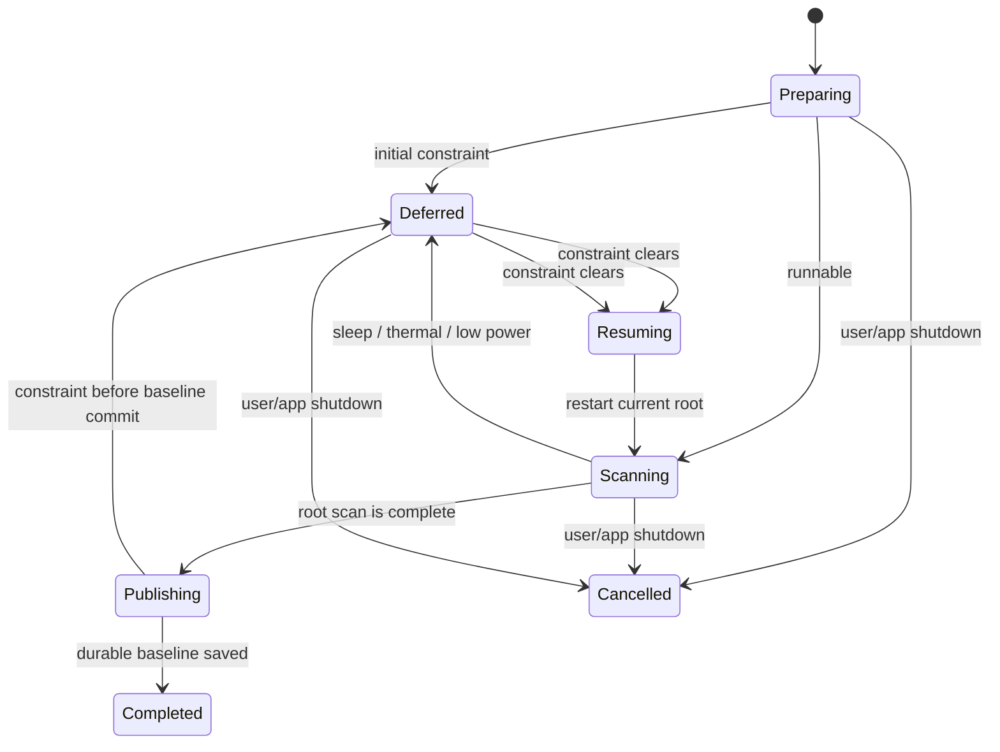

# Scan Scheduling Lifecycle

Status: **Implemented application policy and native signal adapter; real sleep/wake qualification pending**

Chinese companion translation: [scan-scheduling-lifecycle.zh-CN.md](scan-scheduling-lifecycle.zh-CN.md). This English document remains the engineering source of truth.

## Purpose and claim boundary

The authorized-baseline flow must yield when continuing would compete with the system or cross an unsafe lifecycle boundary. This slice observes public macOS power, thermal, and workspace notifications, converts them into application-owned values, and makes the baseline coordinator pause and resume without publishing a transient partial result.

“Resume” means restarting the current root from its durable dirty-work boundary. It does not mean continuing from an in-memory directory-enumerator offset, and it does not survive process termination as a mid-scan continuation. Roots completed earlier in the same live batch remain in that batch; an app restart starts a new batch and may only restore a previously committed baseline.

## Ownership

| Layer | Responsibility |
| --- | --- |
| `SpaceTracePlatform` | Sample `ProcessInfo` thermal/Low Power Mode state, sample the providing power source through public IOKit power-source APIs, and observe `NSWorkspace` sleep/wake notifications. |
| `SpaceTraceApplication` | Own stable value types, precedence, decision policy, replaying scheduling gate, deferred/resumed states, and cancellation/retry behavior. |
| `SpaceTraceApp` | Construct and retain one native monitor, inject its gate into the baseline coordinator, and stop the monitor before asynchronous app shutdown. |
| SwiftUI overview | Explain why work is paused, the condition that will resume it, completed-root count, current power-source label, and safe cancellation. |

Platform notifications never select product behavior directly. They only refresh a complete `ScanSchedulingSnapshot`; the application policy derives one decision from it.

## Policy

The decision precedence is deterministic:

1. system sleeping;
2. serious or critical thermal pressure;
3. Low Power Mode;
4. runnable.

An explicitly user-started baseline remains runnable on ordinary battery power, matching the architecture policy. The power source is still retained in the typed snapshot. Background/incremental rate limiting and token-bucket budgets are separate work and must not be inferred from this implementation.

## Lifecycle

While a root is active, the coordinator races the calibration task against the replaying scheduling stream using structured concurrency. A deferral cancels and awaits the calibration child before publishing the deferred UI state. The calibration pipeline therefore discards staging and retains dirty work according to its existing cancellation invariant. After eligibility returns, the same root is resolved and scanned again. A second gate runs before volume sampling and durable baseline save.

## Signal and lifetime rules

- The native monitor observes Foundation thermal and power-mode notifications, AppKit sleep/wake notifications, and an IOKit power-source run-loop source.
- Its IOKit callback context is an immutable callback box retained until the run-loop source is removed. This documented lifetime is the only `@unchecked Sendable` escape hatch in the adapter.
- The application scheduling gate replays its current decision to every subscriber and suppresses identical snapshots.
- The app stops notification tasks and removes the IOKit run-loop source before awaiting baseline and monitoring shutdown.
- User cancellation remains distinct from scheduler cancellation and ends in the existing typed `cancelled` state.

## Verification and remaining qualification

Deterministic tests cover policy precedence, ordinary-battery eligibility, current-state replay, duplicate suppression, initial deferral without a scanner invocation, mid-scan cancellation, retry of the same root, and native-to-application value mapping. Debug and Release application builds verify the real composition path.

These tests do not prove that a specific Mac model and OS version emits every native notification in every sleep transition. Before release qualification, run a signed sandbox matrix on macOS 15.6 and the current stable macOS that exercises real sleep/wake, AC/battery transitions, Low Power Mode, and safely induced thermal pressure. The UI must never claim that this deterministic coverage is real-device qualification.
