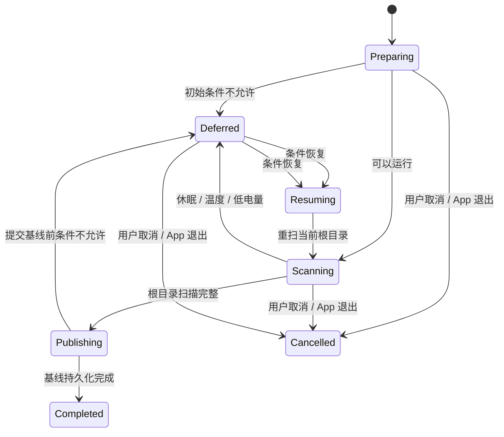

# 扫描调度生命周期

状态：**应用层策略与原生信号适配器已实现；真实睡眠/唤醒资格验证待完成**

英文事实源：[scan-scheduling-lifecycle.md](scan-scheduling-lifecycle.md)。本文是便于中文阅读的对应译文；如两者存在差异，以英文文档为工程事实源，并应在同一次变更中修正译文。

## 目的与声明边界

当继续扫描会与系统争夺资源，或跨越不安全的生命周期边界时，已授权目录基线流程必须主动让出资源。本切片使用公开的 macOS 电源、温度和工作区通知，把它们转换为应用层拥有的值，并让基线协调器在不发布临时部分结果的前提下暂停和恢复。

这里的“恢复”是指从持久 dirty work 边界重新扫描当前根目录，而不是从内存中的目录枚举偏移量继续，也不是进程退出后的扫描中点续传。同一存活批次中已经完成的根目录会保留在该批次内；App 重启后会开始新批次，只能恢复此前已经提交的基线。

## 所有权

| 层 | 职责 |
| --- | --- |
| `SpaceTracePlatform` | 读取 `ProcessInfo` 温度/低电量模式，通过公开 IOKit 电源 API 读取当前供电来源，并观察 `NSWorkspace` 睡眠/唤醒通知。 |
| `SpaceTraceApplication` | 拥有稳定值类型、优先级、决策策略、可回放调度门、暂停/恢复状态以及取消/重试行为。 |
| `SpaceTraceApp` | 创建并持有唯一原生 monitor，把调度门注入基线协调器，并在异步退出前停止 monitor。 |
| SwiftUI 概览 | 说明暂停原因、自动恢复条件、已完成根目录数量、当前供电来源以及安全取消入口。 |

平台通知不会直接选择产品行为，只会刷新一份完整的 `ScanSchedulingSnapshot`；应用层策略再从中推导唯一决策。

## 策略

决策优先级固定为：

1. 系统正在休眠；
2. 温度压力为严重或危急；
3. 低电量模式开启；
4. 可以运行。

按照架构策略，用户明确发起的基线扫描在普通电池供电时仍可运行。供电来源仍会保留在类型化快照中。后台/增量工作的限速与 token bucket 预算是后续独立任务，不能从本实现中推断为已经具备。

## 生命周期

根目录扫描期间，协调器使用结构化并发，让校准任务与可回放调度状态流竞争。出现暂停条件时，会先取消并等待校准子任务退出，再发布暂停 UI 状态。因此校准流水线会沿用现有不变量：丢弃 staging 并保留 dirty work。条件恢复后，同一根目录会重新解析并扫描。在读取卷容量和持久化基线之前还会再次经过调度门。

## 信号与生命周期规则

- 原生 monitor 观察 Foundation 温度与电源模式通知、AppKit 睡眠/唤醒通知，以及 IOKit 电源 run-loop source。
- IOKit 回调上下文是不可变 callback box，并一直由 monitor 持有到 run-loop source 被移除。这个明确生命周期是适配器中唯一使用 `@unchecked Sendable` 逃生口的安全依据。
- 应用调度门会向每个订阅者先回放当前决策，并抑制完全相同的快照。
- App 在等待基线与监控关闭之前，先取消通知任务并移除 IOKit run-loop source。
- 用户取消与调度器内部取消保持区分；用户取消仍进入现有类型化 `cancelled` 状态。

## 验证与剩余资格验证

确定性测试覆盖策略优先级、普通电池供电可运行、当前状态回放、重复抑制、开始前暂停且不调用 scanner、扫描途中取消、重试同一根目录，以及原生值到应用值的映射。Debug/Release App 构建用于验证真实组合路径。

这些测试不能证明某一具体 Mac 型号和系统版本会在每一种睡眠转换中发出所有原生通知。发布资格验证前，必须在 macOS 15.6 与当前稳定版 macOS 上，用签名 sandbox App 完成真实睡眠/唤醒、交流电/电池切换、低电量模式以及安全可控的温度压力矩阵。UI 与文档都不能把当前确定性覆盖描述成真实设备资格验证。
