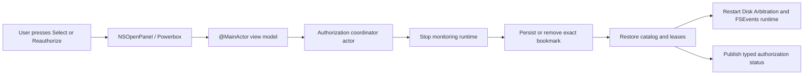

# User-Selected Directory UI and Sandbox Qualification

**Status:** Implemented; current-host smoke complete; macOS 15.6 runtime gate pending a 15.6 environment and stable Apple signing identity

**Scope:** FR-001, FR-011, FR-015, FR-016, NFR-008

**Last updated:** 2026-07-19

## 1. Purpose and evidence boundary

This protocol qualifies the smallest trustworthy permission journey:

1. the user explicitly opens the system directory picker;
2. SpaceTrace persists a read-only app-scoped bookmark for the exact selection;
3. the UI distinguishes authorized, temporarily unavailable, reauthorization-required, unconfigured, and failed states;
4. stale or identity-changing grants require another explicit picker confirmation;
5. removing a grant stops monitoring, removes only the bookmark, and restarts monitoring without deleting user files or historical measurements;
6. a temporarily absent external volume can recover without silently widening the scope.

A build on a newer macOS host is not evidence that the app ran correctly on macOS 15.6. A local ad-hoc signature is useful for implementation smoke testing, but it is not a distribution, notarization, or stable-container-identity qualification.

## 2. Architecture under test



The picker URL is never reconstructed from a text field. The application layer receives the original URL from `NSOpenPanel`; the platform layer creates and immediately resolves a read-only security-scoped bookmark. The coordinator serializes permission mutation with the native runtime so old leases cannot survive a replacement or removal.

## 3. Automated gates

Run the repository gate:

```bash
make verify
```

Run the signed-app preflight on a macOS 15.6 Apple Silicon machine using a build signed with an Apple Development or Developer ID Application identity:

```bash
Scripts/qualify-user-selected-directory.sh /absolute/path/to/SpaceTrace.app
```

The script fails closed unless the host is macOS 15.6.x, the architecture is arm64, the code signature verifies, `LSMinimumSystemVersion` is exactly 15.6, and these entitlements are true:

- `com.apple.security.app-sandbox`
- `com.apple.security.files.user-selected.read-write` (only for the exact
  diagnostic-export file chosen in `NSSavePanel`; monitoring bookmarks remain
  `.securityScopeAllowOnlyReadAccess`)
- `com.apple.security.files.bookmarks.app-scope`

For a newer-host, ad-hoc, non-qualifying smoke preflight only:

```bash
SPACETRACE_ALLOW_NEWER_HOST_SMOKE=1 \
SPACETRACE_ALLOW_ADHOC_SMOKE=1 \
Scripts/qualify-user-selected-directory.sh /absolute/path/to/SpaceTrace.app
```

The warnings in that output are part of the evidence: they prevent the smoke run from being reported as oldest-supported-OS or distribution-signing qualification.

## 4. Controlled fixtures

Use synthetic names and do not select a real personal or project folder.

- Internal fixture: a new empty directory owned by the tester.
- External fixture: a disposable APFS disk image with a uniquely named selected child directory.
- Replacement fixture: a second disposable image using the same displayed volume name but a different volume UUID.

Record only the synthetic scope ID, state code, OS build, architecture, app version, signature class, and pass/fail. Do not attach bookmark data, database files, raw logs, Finder sidebars, home paths, or real volume names.

## 5. Manual matrix

### Q-01 — Initial selection and exact scope

1. Launch the signed sandboxed app with no configured grant.
2. Verify the UI says **No directory selected** and does not open a panel by itself.
3. Press **Select Directory…** using keyboard navigation.
4. Select the controlled child directory, not its parent.
5. Verify the UI shows **Directory authorized** and the exact selected root.
6. Verify no write entitlement and no Full Disk Access prompt exists.

Pass criteria: the system panel is user-triggered; cancel leaves state unchanged; authorization shows only after persistence and runtime restart succeed.

### Q-02 — Genuine process restart

1. Quit SpaceTrace normally and wait for the process to terminate.
2. Relaunch the exact same signed app bundle without rebuilding or re-signing it.
3. Verify the authorized state and exact selected root return without another panel.
4. Verify the process is sandboxed in Activity Monitor or with the signed entitlements.

Pass criteria: restoration is UI-free; one runtime starts; access leases remain balanced on quit.

### Q-03 — User revokes the app grant

1. Press **Remove Authorization**.
2. Verify monitoring stops before the bookmark is removed and then restarts idle.
3. Verify the UI returns to **No directory selected**.
4. Verify files in the fixture and prior SpaceTrace history are not deleted.
5. Press **Select Directory…** and select the fixture again.

Pass criteria: removal is explicit and idempotent from the user's perspective; reauthorization uses the system picker and creates a fresh capability.

This step qualifies SpaceTrace's supported revocation control. It does not claim that macOS provides a central TCC switch for a Powerbox bookmark, and SpaceTrace must never edit the TCC database.

### Q-04 — Stale or identity-changing grant

1. With SpaceTrace quit, invalidate the controlled fixture using an isolated move/replacement procedure. Do not operate on a real user directory.
2. Relaunch the same app bundle.
3. If Foundation reports the bookmark stale, verify **Reauthorization required** and that no automatic bookmark refresh occurs.
4. If the controlled operation produces root or volume identity change instead, record that exact failure code; it is valid fail-closed identity evidence but not a claim that `bookmarkDataIsStale` was observed.
5. Reauthorize through the picker and verify healthy state.

Pass criteria: no parent, replacement path, same-name volume, or ordinary path access is substituted automatically. A true stale-bookmark pass requires direct stale evidence; deterministic unit tests remain the regression gate when the OS does not reproducibly generate stale data.

### Q-05 — External volume absent and returned

1. Authorize the selected child directory on the first disposable APFS image.
2. Quit, detach the image, and relaunch.
3. Verify **Directory currently unavailable**; no panel opens automatically.
4. Reattach the same image and verify the state returns to authorized through bounded retry.
5. Repeat with the same displayed volume name but a different UUID.

Pass criteria: the original volume returns without reauthorization; the different-UUID replacement remains reauthorization-required and cannot inherit monitoring generation or history continuity.

### Q-06 — macOS 15.6 eligibility

On a physical or virtual Apple Silicon macOS 15.6.x environment:

1. run the automated preflight without either smoke override;
2. execute Q-01 through Q-05;
3. run package tests, app unit tests, and the UI/accessibility smoke matrix that the OS supports;
4. record the exact `sw_vers` product/build version and Xcode version;
5. verify normal quit completes within the FR-015 ten-second budget.

Pass criteria: every step passes on 15.6.x. A build or run on macOS 16/26 does not close this gate.

## 6. Result record

| Field | Required value |
|---|---|
| App commit | Full Git commit SHA |
| App version/build | `CFBundleShortVersionString` / `CFBundleVersion` |
| Host | `ProductVersion`, `BuildVersion`, arm64 |
| Signature | Apple identity class; ad-hoc only for smoke |
| Entitlements | sandbox, user-selected read/write for diagnostic save only, app-scoped bookmarks; watched bookmark is explicitly read-only |
| Q-01…Q-06 | Pass / fail / blocked with stable reason code |
| Sensitive evidence | None |

Never collapse **blocked because no macOS 15.6 host or Apple signing identity is available** into pass.

## 7. Current-host smoke record — 2026-07-19

This record is implementation evidence, not macOS 15.6 or distribution-signing qualification.

| Field | Observed value |
|---|---|
| Source | Working tree represented by the commit containing this record; base before the change was `0da5efb` |
| App version/build | `1.0` / `1` |
| Host | macOS 26.5.2 (`25F84`), arm64 |
| Toolchain | Xcode 26.1.1 (`17B100`) |
| Signature | Valid ad-hoc signature; no valid Apple code-signing identity was installed |
| Minimum system | `LSMinimumSystemVersion = 15.6` |
| Entitlements | App Sandbox, user-selected read/write for diagnostic save only, app-scoped bookmarks; watched bookmark is explicitly read-only |
| Fixture privacy | Synthetic internal directory and disposable APFS image only; no real user directory or existing external disk was selected |

| Gate | Result | Evidence boundary |
|---|---|---|
| Q-01 initial exact selection | **Smoke pass** | The picker was opened only by the explicit button; the selected child root became authorized. The signed-entitlement preflight found no read-write grant. |
| Q-02 genuine process restart | **Smoke pass** | SpaceTrace terminated normally, the process disappeared, and the exact same app bundle restored the grant without opening a picker or being rebuilt/re-signed. |
| Q-03 app-level revocation | **Smoke pass** | The UI returned to unconfigured immediately and remained unconfigured after another process restart. A synthetic witness file retained the same content and size. This is bookmark removal, not TCC revocation. |
| Q-04 real stale bookmark | **Not observed** | Deterministic unit/UI-model coverage passes. The host was not forced into a non-reproducible stale state, so no real stale claim is made. |
| Q-05 same external volume returns | **Smoke pass for return path** | A 64 MB disposable APFS image was detached. Relaunch showed unavailable without a picker. Reattaching the same image automatically restored authorization; the pre/post Volume UUID was identical and the witness file survived. The different-UUID UI replacement subcase was not rerun in this smoke record; the isolated non-UI APFS lifecycle test remains its regression evidence. |
| Q-06 macOS 15.6 eligibility | **Blocked** | The strict preflight correctly failed closed on macOS 26.5.2. A real Apple Silicon macOS 15.6.x runner and stable Apple signing identity are still required. |
| UI XCTest launch | **Blocked in this environment** | The ad-hoc test runner did not provide a stable sandbox container identity. The same flow was completed manually against the signed sandbox app; automated UI execution must be rerun with an Apple identity. |

The smoke override preflight passed with explicit warnings. The same preflight without overrides exited with status 2 because the host was not macOS 15.6.x. The disposable image was detached after the test, the test bookmark was removed, and the image file was retained under the synthetic temporary fixture for reproducibility.
