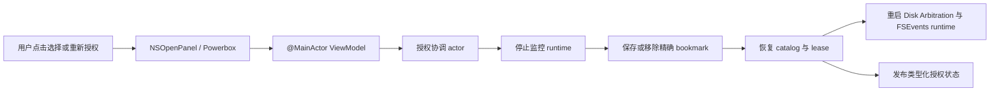

# 用户选择目录 UI 与沙盒资格验证

**状态：** 已实现；与 manifest 绑定的 ad-hoc Public Beta 自动预检已完成；由于当前没有 15.6 环境，macOS 15.6 真实运行和人工矩阵仍保持开放

**范围：** FR-001、FR-011、FR-015、FR-016、NFR-008

**最后更新：** 2026-08-14

## 1. 目的与证据边界

本协议验证最小但可信的权限旅程：

1. 用户主动打开系统目录选择器；
2. SpaceTrace 为精确选择位置保存只读、app-scoped 的 security-scoped bookmark；
3. UI 区分“已授权”“暂时不可用”“需要重新授权”“未配置”和“失败”；
4. stale 或身份变化的授权必须由用户再次通过选择器确认；
5. 移除授权会先停止监控，只移除 bookmark，再恢复监控；不会删除用户文件或历史测量；
6. 暂时缺席的外置卷可以恢复，但 scope 不能静默扩大。

在更新版本 macOS 上编译通过，不代表应用已在 macOS 15.6 正确运行。maintainer 已接受明确披露的 ad-hoc、未公证 Public Beta，因此最终 ad-hoc 产物可以在 macOS 15.6 上关闭本 Beta 的自动最低系统预检；但它绝不证明 Developer ID、公证、发布者身份或未来稳定版的容器策略。

## 2. 被验证的架构



代码不会从文本路径重建 picker URL。应用层只接收 `NSOpenPanel` 返回的原始 URL；平台层创建只读 security-scoped bookmark 并立即验证可解析性。协调器把权限变更与原生 runtime 串行化，防止替换或移除后遗留旧 lease。

## 3. 自动化门禁

运行仓库完整门禁：

```bash
make verify
```

在 Apple Silicon macOS 15.6 主机上，对最终解包 RC App 及其 manifest 运行：

```bash
make qualify-user-selected-directory \
  APP=/绝对路径/SpaceTrace-0.1.0-beta.1.app \
  MANIFEST=/绝对路径/SpaceTrace-0.1.0-beta.1.manifest.json \
  REPORT=/绝对路径/minimum-os-preflight.json
```

脚本采用 fail-closed：只有 manifest 精确且绑定干净源码，App 版本、提交、可执行文件哈希、架构、部署目标、Bundle 身份、ad-hoc/无 Team ID 签名和 Hardened Runtime 全部一致，主机为 macOS 15.6.x arm64，并且以下 entitlement 精确存在时才通过：

- `com.apple.security.app-sandbox`
- `com.apple.security.files.user-selected.read-write`（仅用于 `NSSavePanel` 中用户选择的诊断导出文件；监控 bookmark 仍使用 `.securityScopeAllowOnlyReadAccess`）
- `com.apple.security.files.bookmarks.app-scope`

只在更新系统上做“不计入资格”的 smoke 预检时，可运行：

```bash
make qualify-user-selected-directory \
  APP=/绝对路径/SpaceTrace-0.1.0-beta.1.app \
  MANIFEST=/绝对路径/SpaceTrace-0.1.0-beta.1.manifest.json \
  REPORT=/绝对路径/current-host-smoke.json \
  ALLOW_NEWER_HOST_SMOKE=1
```

该模式只会打印 `SMOKE`，JSON 中写入 `status: "smoke"`，绝不会打印 `PASS`。旧环境变量 override 已不再接受。权限为 `0600` 的 JSON 回执不包含 App、manifest、主目录或卷路径；它绑定版本/源码/manifest/可执行文件身份，并明确 Q-01 至 Q-06 仍需人工执行。预检通过只是人工矩阵的一项输入，不能替代矩阵结论。

## 4. 受控测试夹具

只使用合成名称，不选择真实个人目录或项目目录。

- 内置盘夹具：测试者新建的空目录；
- 外置卷夹具：一次性 APFS 磁盘镜像及其唯一命名的子目录；
- 换卷夹具：显示卷名相同、volume UUID 不同的第二个一次性镜像。

记录只能包含合成 scope ID、状态码、系统 build、架构、App 版本、签名类别和通过/失败。不得附加 bookmark、数据库、原始日志、Finder 侧栏、Home 路径或真实卷名。

## 5. 手工验证矩阵

### Q-01 — 首次选择与精确 scope

1. 在没有已配置授权时启动签名沙盒 App；
2. 确认 UI 显示“尚未选择目录”，并且不会自动弹出选择器；
3. 用键盘操作“选择目录…”；
4. 选择受控子目录，而不是其父目录；
5. 确认 UI 显示“目录已授权”和精确 root；
6. 确认监控 scope 由只读 bookmark 恢复、没有修改被监控文件，也没有 Full Disk Access 提示；单独的“用户选择位置读写” entitlement 只保留给 `NSSavePanel` 中精确选择的诊断导出目标。

通过标准：系统选择器只能由用户触发；取消后状态不变；只有持久化与 runtime 重启都成功后才显示授权成功。

### Q-02 — 真实进程重启

1. 正常退出 SpaceTrace 并等待进程结束；
2. 不重新编译、不重新签名，重新启动同一个 App bundle；
3. 确认授权状态和精确 root 无 UI 恢复；
4. 使用 Activity Monitor 或签名 entitlement 确认进程处于 sandbox。

通过标准：恢复过程不弹选择器；只启动一个 runtime；退出时 access lease 成对释放。

### Q-03 — 用户主动撤销 App 授权

1. 点击“移除授权”；
2. 确认先停止监控、再移除 bookmark，随后以 idle 状态重启；
3. UI 回到“尚未选择目录”；
4. 夹具文件和已有 SpaceTrace 历史均未删除；
5. 再次通过“选择目录…”授权夹具。

通过标准：撤销明确且从用户视角可重复；重新授权必须经过系统选择器并创建新的 capability。

这一步验证的是 SpaceTrace 支持的撤权入口。它不声称 macOS 为 Powerbox bookmark 提供集中式 TCC 开关，SpaceTrace 也绝不能修改 TCC 数据库。

### Q-04 — stale 或身份变化授权

1. 退出 SpaceTrace 后，只用隔离的移动/替换流程使受控夹具失效；不得操作真实用户目录；
2. 重启同一个 App bundle；
3. 如果 Foundation 报告 bookmark stale，确认 UI 显示“需要重新授权”，且不会自动刷新 bookmark；
4. 如果受控操作得到的是 root 或 volume 身份变化，则记录准确失败码；这是有效的 fail-closed 身份证据，但不能写成观察到了 `bookmarkDataIsStale`；
5. 通过系统选择器重新授权并恢复健康状态。

通过标准：不能自动改用父目录、替换路径、同名卷或普通路径访问。真正的 stale 通过必须有直接 stale 证据；当系统不能稳定制造 stale 时，确定性单元测试仍是回归门禁。

### Q-05 — 外置卷缺席与返回

1. 授权第一个一次性 APFS 镜像中的受控子目录；
2. 退出、卸载镜像并重启；
3. 确认 UI 显示“目录当前不可用”，且不会自动弹出选择器；
4. 重新挂载同一个镜像，确认状态通过有界重试回到已授权；
5. 使用显示卷名相同但 UUID 不同的第二个镜像重复测试。

通过标准：原卷返回无需重新授权；不同 UUID 的替换卷必须保持“需要重新授权”，不能继承监控 generation 或历史连续性。

### Q-06 — macOS 15.6 资格

在物理或虚拟 Apple Silicon macOS 15.6.x 环境中：

1. 不带 `--allow-newer-host-smoke` 运行自动预检，并保留 `passed` JSON 回执；
2. 执行 Q-01 至 Q-05；
3. 运行 package tests、App 单元测试，以及该系统可运行的 UI/可访问性 smoke 矩阵；
4. 记录准确的 `sw_vers` product/build 和 Xcode 版本；
5. 确认正常退出满足 FR-015 的十秒预算。

通过标准：所有步骤必须在 15.6.x 上通过。在 macOS 16/26 上构建或运行不能关闭这项门禁。

## 6. 结果记录

| 字段 | 必须记录的值 |
|---|---|
| App commit | 完整 Git commit SHA |
| App 版本/build | `CFBundleShortVersionString` / `CFBundleVersion` |
| 主机 | `ProductVersion`、`BuildVersion`、arm64 |
| 签名 | 本次获批 Beta 的精确 ad-hoc/无 Team ID/Hardened Runtime 事实；不声称 Apple 身份 |
| 自动预检 | 不含路径的 JSON 回执 SHA-256；只有 macOS 15.6.x 才能写 `passed` |
| Entitlement | sandbox、仅用于诊断保存的用户选择读写、app-scoped bookmark；监控 bookmark 明确只读 |
| Q-01…Q-06 | 通过 / 失败 / 阻塞及稳定原因码 |
| 敏感证据 | 无 |

绝不能把“没有 macOS 15.6 主机而阻塞”改写为通过。Developer ID/公证仍是未来稳定版的独立门禁，不是已接受 ad-hoc Beta 的隐藏前提。

## 7. 当前主机 smoke 记录 — 2026-07-19

本记录只作为实现证据，不构成 macOS 15.6 或分发签名资格结论。

| 字段 | 实际值 |
|---|---|
| 源码 | 由包含本记录的 commit 表示；本次变更前的基线为 `0da5efb` |
| App 版本/build | `1.0` / `1` |
| 主机 | macOS 26.5.2（`25F84`），arm64 |
| 工具链 | Xcode 26.1.1（`17B100`） |
| 签名 | 有效 ad-hoc 签名；系统中没有可用的 Apple 代码签名身份 |
| 最低系统 | `LSMinimumSystemVersion = 15.6` |
| Entitlement | App Sandbox、用户选择只读、app-scoped bookmark |
| 夹具隐私 | 只使用合成内置目录和一次性 APFS 镜像；未选择真实用户目录或现有外置磁盘 |

| 门禁 | 结果 | 证据边界 |
|---|---|---|
| Q-01 首次精确选择 | **Smoke 通过** | 只有点击明确按钮后才打开选择器；受控子目录随后进入已授权状态。签名 entitlement 预检确认不存在读写授权。 |
| Q-02 真实进程重启 | **Smoke 通过** | SpaceTrace 正常退出且进程消失；未重新编译、未重新签名，同一个 App bundle 无选择器恢复授权。 |
| Q-03 App 内撤权 | **Smoke 通过** | UI 立即回到未配置，再次重启后仍保持未配置。合成见证文件的内容和大小未变化。本项是 bookmark 移除，不是 TCC 撤权。 |
| Q-04 真实 stale bookmark | **未观察到** | 确定性单元测试和 UI model 测试通过。本机没有强制造成不可复现的 stale 状态，因此不声称真实 stale 通过。 |
| Q-05 同一外置卷返回 | **返回路径 Smoke 通过** | 卸载 64 MB 一次性 APFS 镜像后，重启显示不可用且不弹选择器；重挂同一镜像后自动恢复授权，前后 Volume UUID 完全一致，见证文件保留。本次 smoke 未重新执行不同 UUID 的 UI 换卷子项；隔离的非 UI APFS 生命周期测试继续作为该子项的回归证据。 |
| Q-06 macOS 15.6 资格 | **阻塞** | 历史严格预检在 macOS 26.5.2 上正确 fail-closed。仍需真实 Apple Silicon macOS 15.6.x 环境和新的最终 ad-hoc RC；获批 Beta 模式不要求 Apple 身份。 |
| UI XCTest 启动 | **当前环境阻塞** | 历史 ad-hoc 测试 runner 无法提供稳定沙盒容器身份。同一流程已对签名沙盒 App 完成人工实机操作；自动化属于独立 runner 问题，不会把 Apple 身份变成 Beta 前提。 |

历史 smoke override 预检曾带 warning 通过，但它早于 manifest 绑定的 JSON 契约，不能复用为发布证据。不带 override 的同一预检因主机不是 macOS 15.6.x，以状态码 2 退出。测试结束后已卸载一次性镜像并移除测试 bookmark；镜像文件保留在合成临时夹具中，便于复核。
